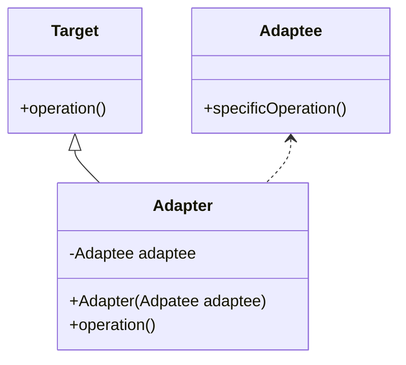
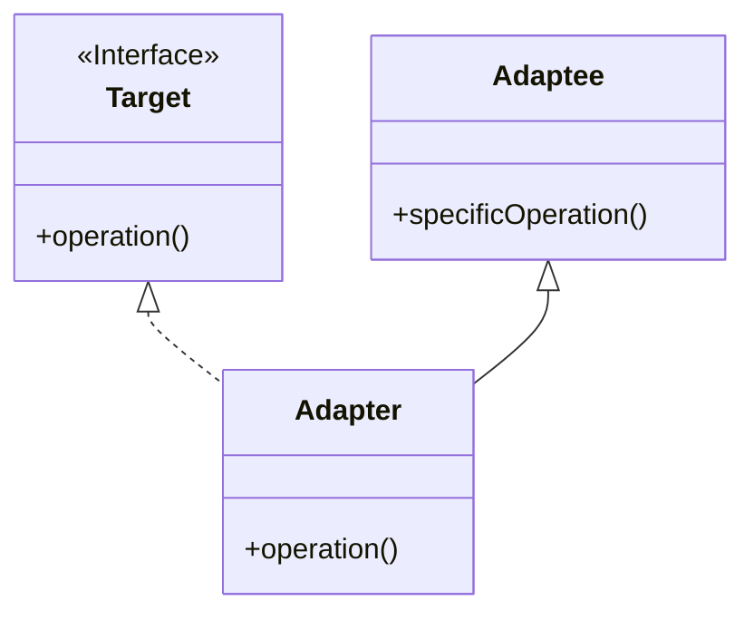

<p align="center">
   
</p>

<h1 align="center">ADAPTER</h1>

<div align="center">
  <b>
    Permite la cooperación entre objetos con interfaces incompatibles.
  </b>
</div>

<hr />

# 1. IMPLEMENTACIÓN (ADAPTADOR DE OBJETO)

## 1.1 - Diagrama UML



## 1.2 - Explicación 

> Target.java


### Paso 1
Definimos los métodos **públicos** de la clase `Target` y vendría a ser la clase homogenea (en la realidad sería enchufe con dos tomas de corriente):
```java
public class Target{
    // ...
    public void operation();
    // ...
}
```

> Adaptee.java


### Paso 2
Definimos los métodos **públicos** de la clase incompatible llamada `Adaptee` (siguiendo el ejemplo anterior sería un enchufe con tres clavijas):
```java
public class Adaptee{
    // ...
    public void specificOperation();
    // ...
}
```

> Adapter.java

### Paso 3
La clase `Adapter` extendrá la clase `Target`:
```java
public class Adapter extends Target{
    // ...
}
```
### Paso 4
La clase `Adapter` crea un objeto **privado** de la clase `Adaptee`:
```java
public class Adapter extends Target{
    private Adpatee adaptee; 
    // ...
}
```
### Paso 5
En el constructor **público** de `Adapter` le inyectaremos la intancia creada anterioramente de la clase `Adaptee`:

```java
public class Adapter extends Target{
    private Adpatee adaptee; 
    public Adapter(Adpatee adaptee){
      this.adaptee = adaptee;
    }
    // ...
}
```
### Paso 6
Sobrescribimos el método heredado de la clase `Target` utilizando en el objeto `adapatee` el método incompatible :

```java
public class Adapter extends Target{
    private Adpatee adaptee; 
    public Adapter(Adpatee adaptee){
      this.adaptee = adaptee;
    }
    @Override
    public void operation(){
      adaptee.specificOperation();
    }
}
```
## 1.3 - Utilización
> Main.java
```java
public class Main {
    public static void main(String[] args) {
        Adaptee adaptee = new Adaptee();
        Target target = new Adapter(adaptee);
        target.operation();
    }
}
```

<hr />

# 2. IMPLEMENTACIÓN (ADAPTADOR DE CLASE)

## 2.1 - Diagrama UML


## 2.2 - Explicación 

> Target.java

### Paso 1
Definimos los métodos de la interface `Target`:
```java
public interface Target{
    void operation();
}
```

> Adaptee.java


### Paso 2
Definimos los métodos **públicos** de la clase incompatible llamada `Adaptee` (siguiendo el ejemplo anterior sería un enchufe con tres clavijas):
```java
public class Adaptee{
    // ...
    public void specificOperation();
    // ...
}
```

> Adapter.java

### Paso 3
La clase `Adapter` extendrá la clase `Adaptee` e implementará la interface `Target`:
```java
public class Adapter extends Adaptee implements Target{
    // ...
}
```
### Paso 4
Sobrescribimos el método de la interface `Target` utilizando en el método incompatible de la clase  `Adaptee`:

```java
public class Adapter extends Adaptee implements Target{
    @Override
    public void operation(){
      specificOperation();
    }
}
```
## 2.3 - Utilización
> Main.java
```java
public class Main {
    public static void main(String[] args) {
        Target target = new Adapter();
        target.operation();
    }
}
```


