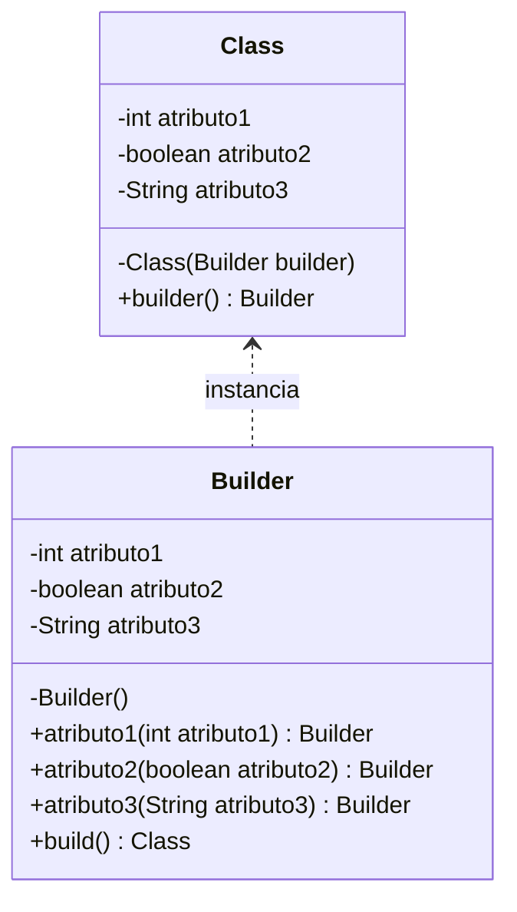

<p align="center">
   
</p>

<h1 align="center">BUILDER</h1>

<div align="center">
  <b>
    Permite construir objetos complejos ocultando la complejidad de su estructura interna.  </b>
</div>

<hr />

# 1. IMPLEMENTACIÓN

## 1.1 - Diagrama UML



## 1.2 - Explicación 

> Class.java

### Paso 1
Crear los atributos **privados y finales** de la clase a instanciar, en este caso es `Class`:
```java
public class Class{
    private final int atributo1 
    private final boolean atributo2 
    private final String atributo3
    // ...
}
```
### Paso 2
Crear el **constructor privado** de la clase `Class`, introducíendole por parámetro una **instancia** de la clase `Builder`:
```java
public class Class{
    // ...
    private Class(Builder builder){
      this.atributo1 = builder.atributo1;
      this.atributo2 = builder.atributo2;
      this.atributo3 = builder.atributo3;
    }
    // ...
}
```
### Paso 3
Definir un método **público y estático** llamado `builder` para crear una instancia de `Builder`:
```java
public class Class{
    // ...
    public static builder(){
      return new Builder();
    }
}
```

> Builder.java

### Paso 1
Crear los atributos **privados** de utilizados en la clase anterior:
```java
public class Builder{
    private final int atributo1 
    private boolean atributo2 
    private String atributo3
}
```

> [!NOTE]  
> En caso de tener algún atributo que es necesario crear un nuevo objeto (por ejemplo una ArrayList) es el momento para instanciar dicho objeto. Por ejemplo: `private ArrayList<String> atributo4 = new ArrayList<>(); `

### Paso 2
Crear el **constructor público** de la clase `Builder`:
```java
public class Builder{
    // ...
    public Builder(int atributo1){
      this.atributo1 = atributo1;
    }
    // ...
}
```

> [!NOTE]  
> El constructor suele estar vacío pero a veces suele tener algún atributo especificado en el enunciado. Tener en cuenta que para atributo introducido en este constructor será privado y final.


### Paso 3
Crear el método **público** de configuración de los campos del `Builder` para cada atributo no utilizado en constructor anterior:
```java
public class Builder{
    // ...
    public Builder atributo2(boolean atributo2){
      this.atributo2 = atributo2;
      return atributo2;
    }

    public Builder atributo3(String atributo3){
      this.atributo3 = atributo3;
      return atributo3;
    }
    // ...
}
```

> [!NOTE]  
> Cuando el atributo es una lista usaremos la sigüentes intanciación:
> ```java
> public Builder atributo4(String atributo4){
>   this.atributo4.add(atributo4);
>   return atributo4;
> }
> ```

### Paso 4
Crear un método *público* llamado `build` o `make` que creará una instancia de la clase `Class`
```java
public class Builder{
    // ...
    public Class build(){
      return new Class(this);
    }
}
```

### Pasos extra 
A veces se nos limitan la forma de crear intancias de la clase principal. Algunas de estas restricciones pueden ser:
· El método atributo2 solamente se puede llamar una única vez --> Crearemos un centinela.
· El método atributo4 se ha de llamar mínimo una vez, se pueden más veces --> Verificamos solamente en el build().
· El método atributo3 es optativo y se puede invocar --> No hace falta hacer nada.

```java
public class Builder{
    private final int atributo1 
    private boolean atributo2 
    private String atributo3
    private ArrayList<String> atributo4 = new ArrayList<>();
    prvate boolean flag = false:

    public Builder(int atributo1){
      this.atributo1 = atributo1;
    }

    public Builder atributo2(boolean atributo2){
      if(this.flag) throw new IllegalStateException();
      this.atributo2 = atributo2;
      this.flag = true;
      return atributo2;
    }

    public Builder atributo3(String atributo3){
      this.atributo3 = atributo3;
      return atributo3;
    }
    public Builder atributo4(String atributo4){
      this.atributo4.add(atributo4);
      return atributo4;
    }
    public Class build(){
      if(atributo2 == null || atributo4.isEmpty()) throw new IllegalStateException();
      return new Class(this);
    }
}
```

