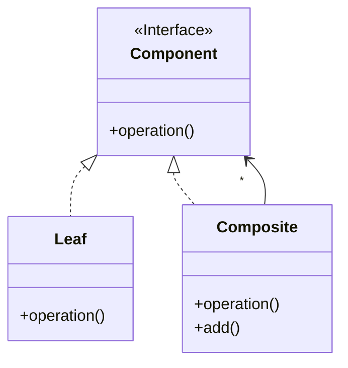

<p align="center">
   
</p>

<h1 align="center">COMPOSITE</h1>

<div align="center">
  <b>
    Permite componer objetos en estructura de árbol y tratar de manera uniforme tanto a los objetos individuales como a los compuestos.
  </b>
</div>

<hr />

# 1. IMPLEMENTACIÓN

## 1.1 - Diagrama UML



## 1.2 - Explicación 

> Component.java


### Paso 1
Definimos  **interface pública** llamada 'Component' con su respectivo método:
```java
public interface Component {
    void operation()
}
```

> Leaf.java

### Paso 2
Definimos la **clase pública** llamada 'Leaf' y hacemos que implemente la interface 'Component':
```java
public class Leaf implements Component {
    //...
}
```

### Paso 3
Sobrescribimos el **método público** a implementar:
```java
public class Leaf implements Component {
    @Override
    public void operation(){
      System.out.println("Leaf operation");
    }
}
```

> Composite.java

### Paso 4
Definimos la **clase pública** llamada 'Composite' y hacemos que implemente la interface 'Component':
```java
public class Composite implements Component {
    //...
}
```

### Paso 5
Como tenemos una multiplicidad indeterminada, por lo tanto habrá que almacenar todas las intancias creadas de 'Component' en una lista:
```java
public class Composite implements Component {
    private List<Component> components = new ArrayList<>();
    //...
}
```


### Paso 6
Implementamos un **método público** que permita añadir componentes al compuesto (pueden ser de la clase 'Composite' o 'Leaf':
```java
public class Composite implements Component {
    private List<Component> components = new ArrayList<>();
    //...
}
```

### Paso 2
Hacemos que cada producto concreto implemente la interface anterior y su respectivo método:
```java
public class ConcreteProductA implements Product{
    @Override
    public String price(){
      return new String("10€");
    }
}
```
```java
public class ConcreteProductB implements Product{
    @Override
    public String price(){
      return new String("5€");
    }
}
```
```java
public class ConcreteProductC implements Product{
    @Override
    public String price(){
      return new String("20€");
    }
}
```

> Factory.java

### Paso 3
Definimos una clase **pública y abstracta** llamada `Factory`:
```java
public abstract class Factory{
    // ...
}
```

### Paso 4
Definimos un método **público y abstracto** llamado `factoryMethod()` y nos aseguramos que devuelva una instancia de la interface común `Product`:
```java
public abstract class Factory{
    public abstract Product factoryMethod();
}
```

> FactoryA.java

> FactoryB.javA

> FactoryC.java

### Paso 5
Para cada producto concreto creamos su respectiva factoría y que heredará de la `Factory` principal. Devolveremos una intancia de cada producto concreto, teniendo en cuenta que su tipo será el de la interface.
```java
public class FactoryA extends Factory{
    @Override
    public Product factoryMethod() {
      return new ConcreteProductA();
    }
}
```
```java
public class FactoryB extends Factory{
    @Override
    public Product factoryMethod() {
      return new ConcreteProductB();
    }
}
```
```java
public class FactoryC extends Factory{
    @Override
    public Product factoryMethod() {
      return new ConcreteProductC();
    }
}
```

## 1.3 - Utilización
> Main.java
```java
public class Main {
    public static void main(String[] args) {
        Factory factory = new FactoryA();
        Product productA = factory.factoryMethod();

        Factory factory = new FactoryB();
        Product productB = factory.factoryMethod();

        Factory factory = new FactoryC();
        Product productC = factory.factoryMethod();
    }
}
```


