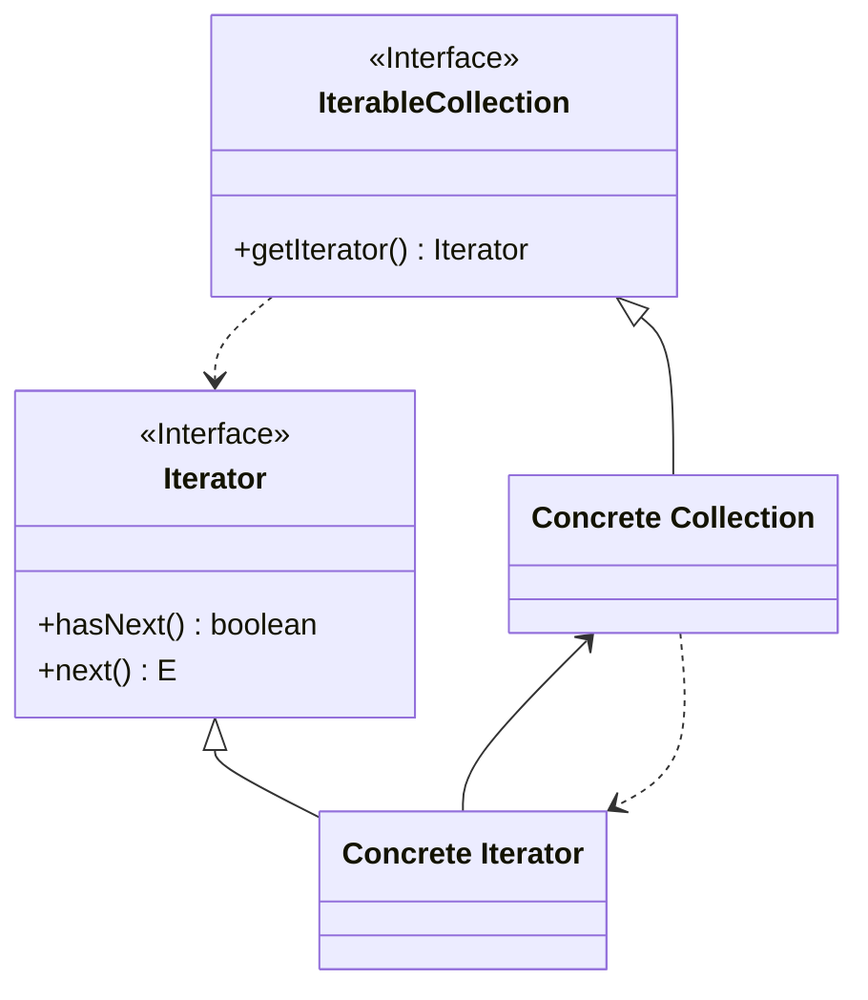

<p align="center">
   
</p>

<h1 align="center">ITERATOR</h1>

<div align="center">
  <b>
    Permite recorrer secuencialmente elementos de una colección sin exponer su representación interna.
  </b>
</div>

<hr />

# 1. IMPLEMENTACIÓN

## 1.1 - Diagrama UML



## 1.2 - Explicación 

> Iterator.java


### Paso 1
Definimos la interface `Iterator<E>` de tipo génerica (<E>) y contendrá  
```java
public interface Iterator<E>{
  boolean hasNext(); 
  E next();
}
```
Una breve explicación de cada método:

-  **boolean hasNext()**
    - Devuelve true si la siguiente iteración tiene más elementos.
-  **E next())**
    - Devuelve el siguiente elemento de la iteración.

> IterableCollection.java

### Paso 2
Definimos la interface `IterableCollection<E>` de tipo génerica (<E>) y contendrá un método llamado *getIterator()* que devolverá una instancia del iterador. 

```java
public interface IterableCollection<E>{
  Iterator<E> getIterator();
}
```

> ConcreteIterator.java

### Paso 3
Definimos la **clase pública** llamada `ConcreteIterator`  y hacemos que implemente la interface `Iterator<E>`:
```java
public class ConcreteIterator<E> implements Iterator<E> {
    //...
}
```

### Paso 4
Definimos una estructura de datos a recorrer mediante el iterador, crearemos instancia ArrayList **pública y final** y una variable entera auxiliar que nos ayude a indicar la posición actual en la lista:
```java
public class ConcreteIterator<E> implements Iterator<E> {
    private final ArrayList<E> a;
    private int pos = 0;

    public ConcreteIterator(ArrayList<E> a){
        this.a = a;
    }

    //...
}
```


### Paso 5
Definimos el método *hasNext()*; retornaremos true cuando la posicón sea menor al tamaño del array: 

```java
public class ConcreteIterator<E> implements Iterator<E> {
    private final ArrayList<E> a;
    private int pos = 0;

    public ConcreteIterator(ArrayList<E> a){
        this.a = a;
    }

    @Override
    public boolean hasNext(){
      return pos < a.size();
    }
    //...
}
```


### Paso 6
Definimos el método *next()*; retornaremos el valor valor de la siguiente posición: 
```java
public class ConcreteIterator<E> implements Iterator<E> {
    private final ArrayList<E> a;
    private int pos = 0;

    public ConcreteIterator(ArrayList<E> a){
        this.a = a;
    }

    @Override
    public boolean hasNext(){
      return pos < a.size();
    }

    @Override
    public E next(){
      if(!hasNext()) throw new NoSuchElementException(); 
      return a.get(pos++);
    }
}
```

> IterableCollection.java

### Paso 7
Definimos la **clase pública** llamada 'IterableCollection' e implementará la interface 'IterableCollection':
```java
public class IterableCollection<E> interface IterableCollection<E>{
  private final ArrayList<E> collection;

  public IterableCollection (ArrayList<E> collection){
    this.collection = collection;
  }
  // ...
} 
```

### Paso 8
Implementamos el método *getIterator()* y su función será retornar el iterador;
```java
public class IterableCollection<E> interface IterableCollection<E>{
  private final ArrayList<E> collection;

  public IterableCollection (ArrayList<E> collection){
    this.collection = collection;
  }
  
  @Override
  public IterableCollection<E> getIterator(){
    return new ConcreteIterator<>(collection);
  } 
} 
```


## 1.3 - Utilización
> Main.java
```java
public class Main {
    public static void main(String[] args) {
        ArrayList<String> c = new ArrayList<>();

        a.add("e1");
        a.add("e2");
        a.add("e3");

        IterableCollection<String> iterable = new IterableCollection<>(c);
        Iterator<String> it = iterable.getIterator();

        while(iterator.hasNext()) {
          String element = iterator.next();
          System.out.println(element);
        } 
    }
}
```


