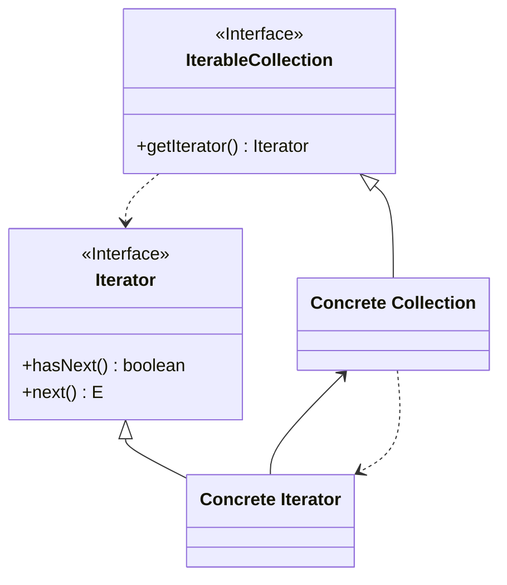

<p align="center">
   
</p>

<h1 align="center">ITERATOR</h1>

<div align="center">
  <b>
    Permite recorrer secuencialmente elementos de una colección sin exponer su representación interna.
  </b>
</div>

<hr />

# 1. IMPLEMENTACIÓN

## 1.1 - Diagrama UML



## 1.2 - Explicación 

> Iterator.java


### Paso 1
Definimos la interface `Iterator<E>` de tipo génerica (<E>) y contendrá  
```java
public interface Iterator<E>{
  boolean hasNext(); 
  public E next();
}
```
Una breve explicación de cada método:

-  **boolean hasNext()**
    - Devuelve true si la siguiente iteración tiene más elementos.
-  **public E next())**
    - Devuelve el siguiente elemento de la iteración.

> IterableCollection.java

Definimos la interface `IterableCollection<E>` de tipo génerica (<E>) y contendrá un método llamado *getIterator()* que devolverá una instancia del iterador. 

```java
public interface IterableCollection<E>{
  public Iterator<E> getIterator();
}
```

> ConcreteIterator.java

### Paso 2
Definimos la **clase pública** llamada `ConcreteIterator`  y hacemos que implemente la interface `Iterator<E>`:
```java
public class ConcreteIterator implements Iterator<E> {
    //...
}
```

### Paso 3
Definimos la **clase pública** llamada `ConcreteIterator`  y hacemos que implemente la interface `Iterator<E>`:
```java
public class ConcreteIterator implements Iterator<E> {
    private LinkedList<E> list = new LinkedList<>();
    //...
}
```

### Paso 3
Definimos una variable que será observada y cuando esta cambie (generalmente en algún setter) se avisarán a los observadores, con el método *setChanged()* marcaremos que la variable ha cambiado y con el método *notifyObservers()* notificaremos a todos los observadores. 
```java
public class ConcreteObservable extends Observable {
    private int variableToObserve;

    public void setVariableToObserve(int variableToObserve){
      this.variableToObserve = variableToObserve;
      setChanged();
      notifyObservers();
    }
    //...
}
```

> Observer.java

### Paso 4
Definimos la **interface** llamada 'Observer' y contendra un método llamado *update()*:
```java
public interface Observer{
    void update(Observable o, Object arg);
}
```

> ConcreteObserver.java

### Paso 4
Definimos la **clase pública** llamada 'ConcreteObserver' e implementará la interface 'Observer':
```java
public class ConcreteObserver interface Observer{
    private int variableToObserve;
     //...
}
```

### Paso 5
Implementamos el método **público y void** *update()* teniendo en cuenta que recibirá objeto Observable (nos tenemos que asegurar que sea una instancia de ConcreteObservable):
```java
public class ConcreteObserver interface Observer{
  private int variableToObserve;
  @Override
  público void update(Observable o, Object arg){
    if( o instanceof ConcreteObservable){
      ConcreteObservable concreteObservable = (ConcreteObservable) o; //Casteamos el objeto a su específica clase Observable
      this.variableToObserve = concreteObservable.getVariableToObserve(); //Obtenemos el valor modificado
        System.out.println(variableToObserve);
    }
    }
  }      
}
```


## 1.3 - Utilización
> Main.java
```java
public class Main {
    public static void main(String[] args) {
        ConcreteObservable obs = new ConcreteObservable();

        ConcreteObserver o1 = new ConcreteObserver();
        ConcreteObserver o2 = new ConcreteObserver();

        obs.addObserver(o1);
        obs.addObserver(o2);

        obs.setVariableToObserve(6);
        
    }
}
```


