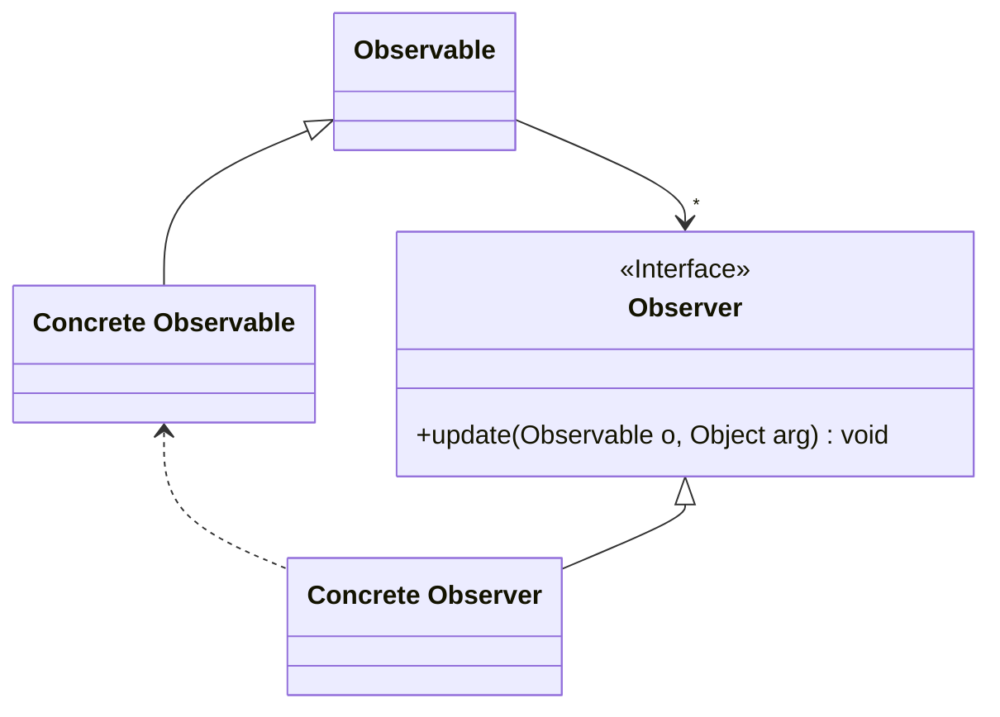

<p align="center">
   
</p>

<h1 align="center">OBSERVER</h1>

<div align="center">
  <b>
    Permite notificar cuando un objeto cambia a varios objetos para que se notifiquen y actualicen.  </b>
</div>

<hr />

# 1. IMPLEMENTACIÓN

## 1.1 - Diagrama UML



## 1.2 - Explicación 

> Observable.java


### Paso 1
Es una clase que viene ya implementada en la paquete 'utils' de Java a partir de la versión 8. 
```java
public class Observable {
  public void addObserver(Observer o) { ... }
  public void deleteObserver(Observer o) { ... }
  public void deleteObservers() { ... }
  public int countObservers() { ... }

  public void notifyObservers() { ... }
  public void notifyObservers(Object arg) { ... }

  protected void setChanged() { ... }
  protected void clearChanged() { ... }
  public boolean hasChanged() { ... }
}
```
Una breve explicación de cada método:

-  **public void addObserver(Observer o)**
    - Agrega un observador al conjunto de observadores de este objeto, siempre y cuando el observador no esté ya en el conjunto.
-  **public void deleteObserver(Observer o)**
    - Elimina un observador especificado del conjunto de observadores.
-  **public void deleteObservers()**
    - Borra la lista de observadores.
-  **public int countObservers()**
    - Devuelve el número de observadores.
-  **public void notifyObservers()**
    -  Si este objeto ha cambiado, como lo indica el método, notifique a todos sus observadores.
-  **public void notifyObservers(Object arg)**
    - Si este objeto ha cambiado, como lo indica el método, notifique a todos sus observadores.
-  **protected void setChanged()**
    - Marca este objeto Observable como modificado; el método hasChanged ahora devolverá true.
-  **protected void clearChanged()**
    - Indica que este objeto ya no ha cambiado o que ha cambiado ya ha notificado a todos sus observadores su cambio más reciente, de modo que el método hasChanged ahora devolverá false.
-  **public boolean hasChanged()**
    - Comprueba si este objeto ha cambiado.

> ConcreteObservable.java

### Paso 2
Definimos la **clase pública** llamada 'ConcreteObservable' y hacemos que extienda la clase  'Observable' (todos los cambios que se hagas sobre este Observable tendrán que ser notificados a sus obseervadores):
```java
public class ConcreteObservable extends Observable {
    //...
}
```

### Paso 3
Definimos una variable que será observada y cuando esta cambie (generalmente en algún setter) se avisarán a los observadores, con el método *setChanged()* marcaremos que la variable ha cambiado y con el método *notifyObservers()* notificaremos a todos los observadores. 
```java
public class ConcreteObservable extends Observable {
    private int variableToObserve;

    public void setVariableToObserve(int variableToObserve){
      this.variableToObserve = variableToObserve;
      setChanged();
      notifyObservers();
    }
    //...
}
```

> Observer.java

### Paso 4
Definimos la **interface** llamada 'Observer' y contendra un método llamado *update()*:
```java
public interface Observer{
    void update(Observable o, Object arg);
}
```

> ConcreteObserver.java

### Paso 4
Definimos la **clase pública** llamada 'ConcreteObserver' e implementará la interface 'Observer':
```java
public class ConcreteObserver interface Observer{
    private int variableToObserve;
     //...
}
```

### Paso 5
Implementamos el método **público y void** *update()* teniendo en cuenta que recibirá objeto Observable (nos tenemos que asegurar que sea una instancia de ConcreteObservable):
```java
public class ConcreteObserver interface Observer{
  private int variableToObserve;
  @Override
  público void update(Observable o, Object arg){
    if( o instanceof ConcreteObservable){
      ConcreteObservable concreteObservable = (ConcreteObservable) o; //Casteamos el objeto a su específica clase Observable
      this.variableToObserve = concreteObservable.getVariableToObserve(); //Obtenemos el valor modificado
        System.out.println(variableToObserve);
    }
    }
  }      
}
```


## 1.3 - Utilización
> Main.java
```java
public class Main {
    public static void main(String[] args) {
        ConcreteObservable obs = new ConcreteObservable();

        ConcreteObserver o1 = new ConcreteObserver();
        ConcreteObserver o2 = new ConcreteObserver();

        obs.addObserver(o1);
        obs.addObserver(o2);

        obs.setVariableToObserve(6);
        
    }
}
```


