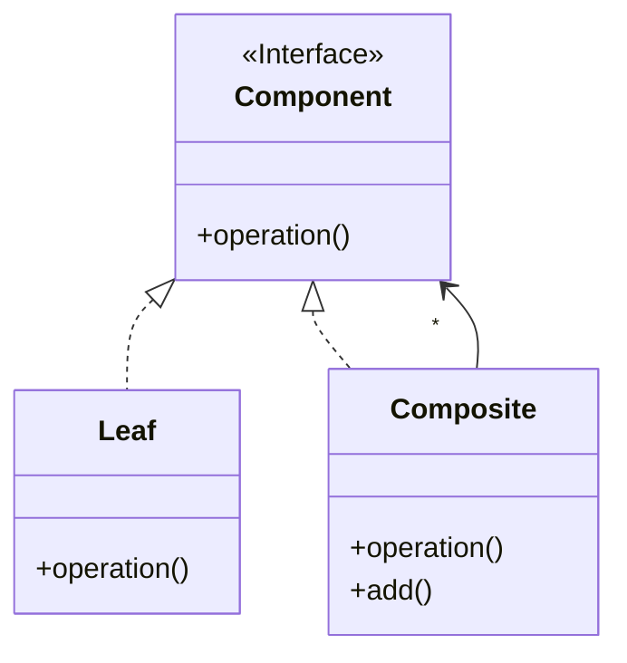

<p align="center">
   
</p>

<h1 align="center">OBSERVER</h1>

<div align="center">
  <b>
    Permite notificar cuando un objeto cambia a varios objetos para que se notifiquen y actualicen.  </b>
</div>

<hr />

# 1. IMPLEMENTACIÓN

## 1.1 - Diagrama UML



## 1.2 - Explicación 

> Component.java


### Paso 1
Definimos  **interface pública** llamada 'Component' con su respectivo método:
```java
public interface Component {
    void operation()
}
```

> Leaf.java

### Paso 2
Definimos la **clase pública** llamada 'Leaf' y hacemos que implemente la interface 'Component':
```java
public class Leaf implements Component {
    //...
}
```

### Paso 3
Sobrescribimos el **método público** a implementar:
```java
public class Leaf implements Component {
    @Override
    public void operation(){
      System.out.println("Leaf operation");
    }
}
```

> Composite.java

### Paso 4
Definimos la **clase pública** llamada 'Composite' y hacemos que implemente la interface 'Component':
```java
public class Composite implements Component {
    //...
}
```

### Paso 5
Como tenemos una multiplicidad indeterminada habrá que almacenar todas las intancias creadas de 'Component' en una lista:
```java
public class Composite implements Component {
    private List<Component> components;
    public Component(){
      this.components = new ArrayList<>();
    }
    //...
}
```


### Paso 6
Implementamos un **método público** que permita añadir componentes al compuesto (pueden ser de la clase 'Composite' o 'Leaf':
```java
public class Composite implements Component {
    private List<Component> components;
    public Component(){
      this.components = new ArrayList<>();
    }
    public void addComponent(Component c){
      components.add(c);
    }
    //...
}
```

### Paso 7
Finalmente implementamos el **método público** que permita recorrer la lista de componentes invocando de nuevo al método *operation()* y así recursivamente hasta llegar a una hoja:
```java
public class Composite implements Component {
    private List<Component> components;
    public Component(){
      this.components = new ArrayList<>();
    }
    public void addComponent(Component c){
      components.add(c);
    }
    @Override
    public void operation(){
      System.out.println("Composite operation");
      for(Component c : components){
        c.operation();
      }
    }
}
```


## 1.3 - Utilización
> Main.java
```java
public class Main {
    public static void main(String[] args) {
        Composite composite1 = new Composite();
        Component leaf1 = new Leaf();
        Component leaf2 = new Leaf();
        Composite composite2 = new Composite();
        Component leaf3 = new Leaf();

        composite2.add(leaf3);
        composite1.add(composite2);
        composite1.add(leaf1);
        composite1.add(leaf2);

        composite1.print();
    }
}
```


